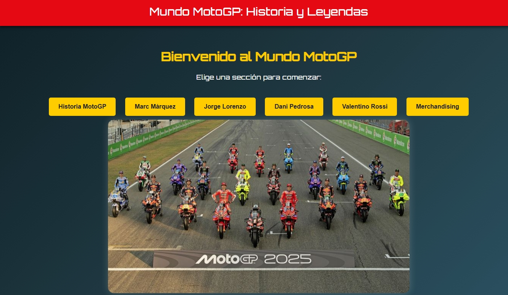
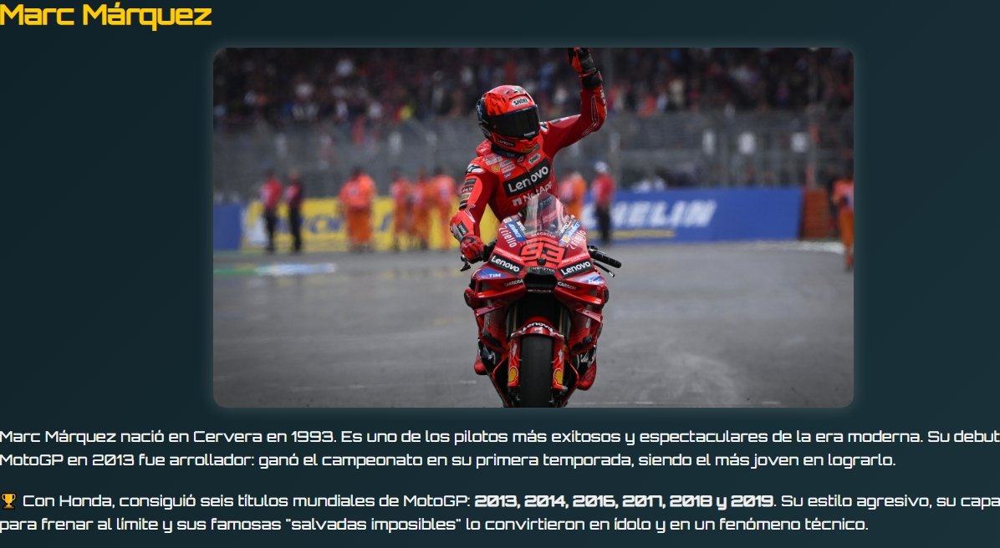
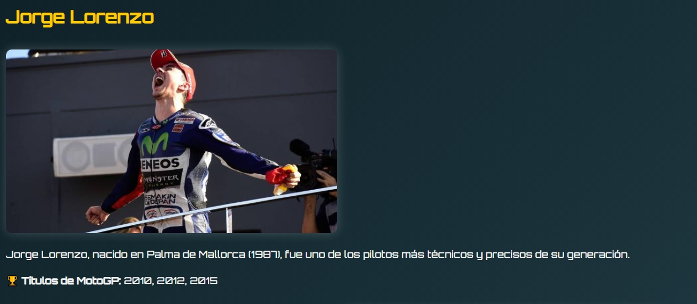
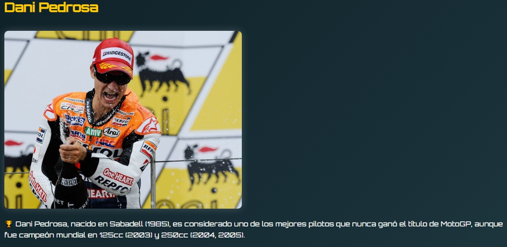
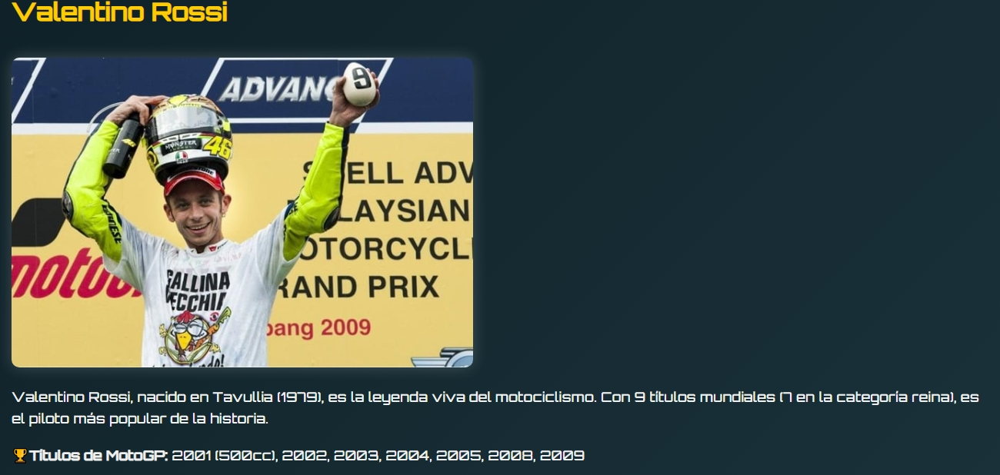
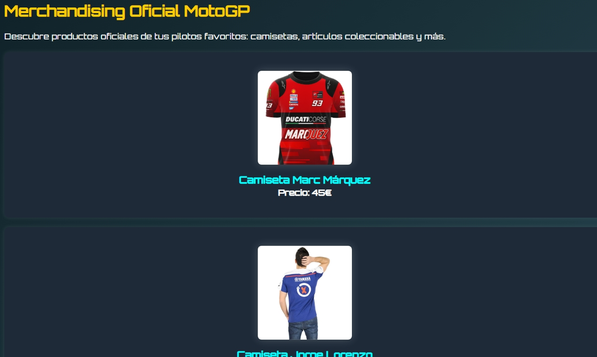

# Practica-Final

## Descripció del projecte i tema escollit

Aquest projecte és una pàgina web dedicada al món de MotoGP. He escollit aquest tema perquè últimament m'està interessant molt aquest esport. M'agrada veure les carreres, seguir els pilots i saber més sobre la seva història. Per això, he pensat que fer una web sobre això seria una bona manera d’aprendre i també de compartir el que vaig descobrint.

## Explicació del layout i estructura

La web està dividida en diverses seccions:

- **Història de MotoGP**: On explico una mica la seva història
- **Pilots**: He escollit alguns dels més famosos com Marc Márquez, Jorge Lorenzo, Dani Pedrosa i Valentino Rossi. Cada un té la seva pròpia pàgina amb informació i imatges.
- **Merchandising**: Una secció com si fos una botiga amb alguns productes relacionats.

Totes les seccions estan connectades amb un menú de navegació amb botons que permeten passar d'una secció a una altra de manera fàcil i ràpida.

## Detalls sobre l'estil CSS i els efectes visuals

He creat diferents fitxers CSS per a cada secció. Cada pilot té el seu propi estil amb colors que el representen. Per exemple:

- **Marc Márquez** i **Jorge Lorenzo** tenen un fons degradat en tons vermells perquè són colors forts i agressius, com el seu estil de conducció.
- **Valentino Rossi** té un estil més groc i taronja.
- **Dani Pedrosa** té un estil més elegant i suau, amb fons grisos.
- La secció de **Merchandising** sembla una botiga online, amb productes, imatges i efectes de zoom.

També he utilitzat alguns efectes visuals com:

- **Responsive design** perquè es pugui veure bé en mòbils.

## Decisions de disseny i raonaments

He volgut fer que cada pàgina tingui una personalitat pròpia, segons el pilot, però mantenint una estructura comuna per no perdre la coherència del projecte.

Vaig decidir separar els CSS perquè sigui més fàcil entendre com funciona cada part i també per practicar com s’organitza un projecte més gran.

He triat fer servir botons per navegar perquè és més visual i senzill que fer-ho amb enllaços normals. Això ajuda també a que sembli més com una app.

## Captures de pantalla

### Pàgina principal

### Secció Marc Márquez

### Secció Jorge Lorenzo

### Secció Dani Pedrosa

### Secció Valentino Rossi

### Secció Merchandising

